# E-Commerce Web Application – Detailed Use Case Diagrams

Companion to [ecommerce-use-cases.md](./ecommerce-use-cases.md). Each use case (UC-01 … UC-32) has one Mermaid diagram showing the main flow, alternative flows, and the actors/systems involved.

- **Sequence diagrams** are used where several actors/systems interact (who talks to whom, in what order).
- **Flowcharts** are used where decisions and branches dominate. Rounded = start/end, diamond = decision, `ALT` nodes mark alternative flows.

---

## 1. Customer-facing use cases

### UC-01 Register Account
Actor: Guest · Pre: email not registered · Post: active account, cart merged

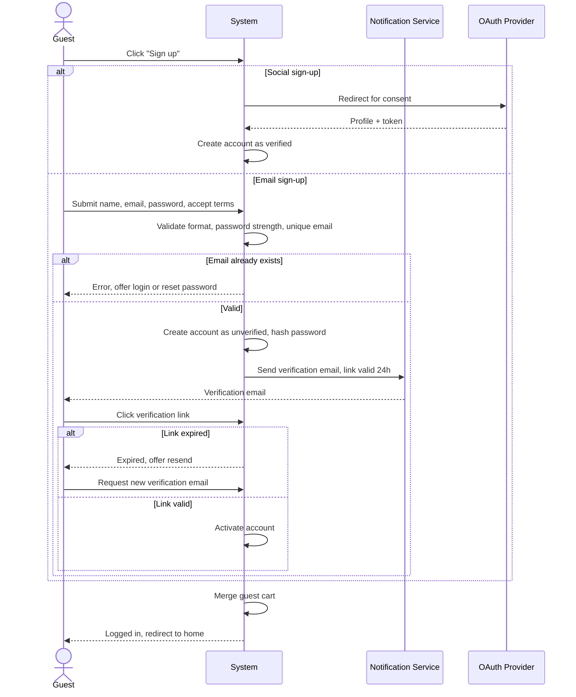
```mermaid
sequenceDiagram
    actor G as Guest
    participant S as System
    participant N as Notification Service
    participant O as OAuth Provider

    G->>S: Click "Sign up"
    alt Social sign-up
        S->>O: Redirect for consent
        O-->>S: Profile + token
        S->>S: Create account as verified
    else Email sign-up
        G->>S: Submit name, email, password, accept terms
        S->>S: Validate format, password strength, unique email
        alt Email already exists
            S-->>G: Error, offer login or reset password
        else Valid
            S->>S: Create account as unverified, hash password
            S->>N: Send verification email, link valid 24h
            N-->>G: Verification email
            G->>S: Click verification link
            alt Link expired
                S-->>G: Expired, offer resend
                G->>S: Request new verification email
            else Link valid
                S->>S: Activate account
            end
        end
    end
    S->>S: Merge guest cart
    S-->>G: Logged in, redirect to home
```

### UC-02 Log In / Log Out
Actor: Customer · Pre: account verified · Post: authenticated session / session invalidated

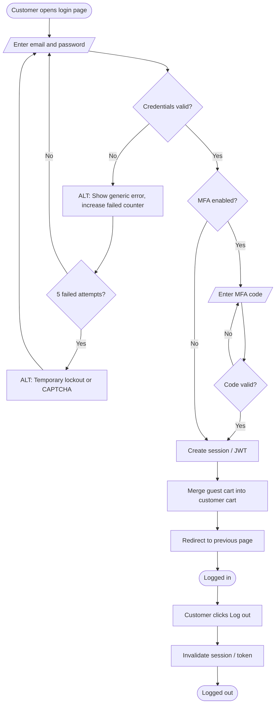
```mermaid
flowchart TD
    A([Customer opens login page]) --> B[/Enter email and password/]
    B --> C{Credentials valid?}
    C -- No --> D["ALT: Show generic error, increase failed counter"]
    D --> E{"5 failed attempts?"}
    E -- Yes --> F["ALT: Temporary lockout or CAPTCHA"] --> B
    E -- No --> B
    C -- Yes --> G{MFA enabled?}
    G -- Yes --> H[/Enter MFA code/] --> I{Code valid?}
    I -- No --> H
    I -- Yes --> J
    G -- No --> J[Create session / JWT]
    J --> K[Merge guest cart into customer cart]
    K --> L[Redirect to previous page]
    L --> M([Logged in])
    M --> N[Customer clicks Log out]
    N --> O[Invalidate session / token]
    O --> P([Logged out])
```

### UC-03 Reset Password
Actor: Customer

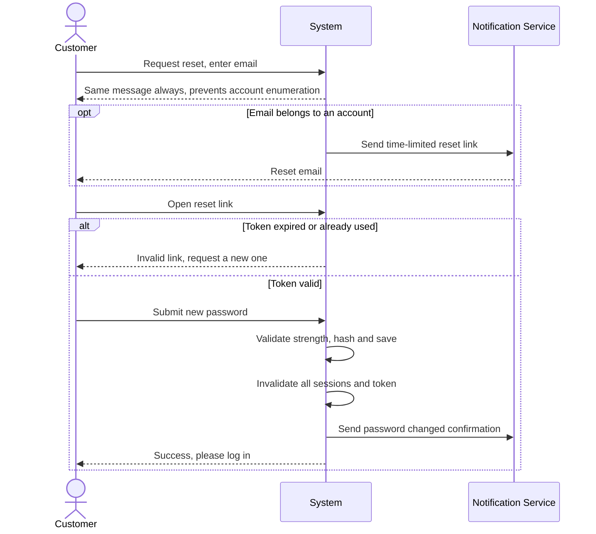
```mermaid
sequenceDiagram
    actor C as Customer
    participant S as System
    participant N as Notification Service

    C->>S: Request reset, enter email
    S-->>C: Same message always, prevents account enumeration
    opt Email belongs to an account
        S->>N: Send time-limited reset link
        N-->>C: Reset email
    end
    C->>S: Open reset link
    alt Token expired or already used
        S-->>C: Invalid link, request a new one
    else Token valid
        C->>S: Submit new password
        S->>S: Validate strength, hash and save
        S->>S: Invalidate all sessions and token
        S->>N: Send password changed confirmation
        S-->>C: Success, please log in
    end
```

### UC-04 Manage Profile & Addresses
Actor: Customer

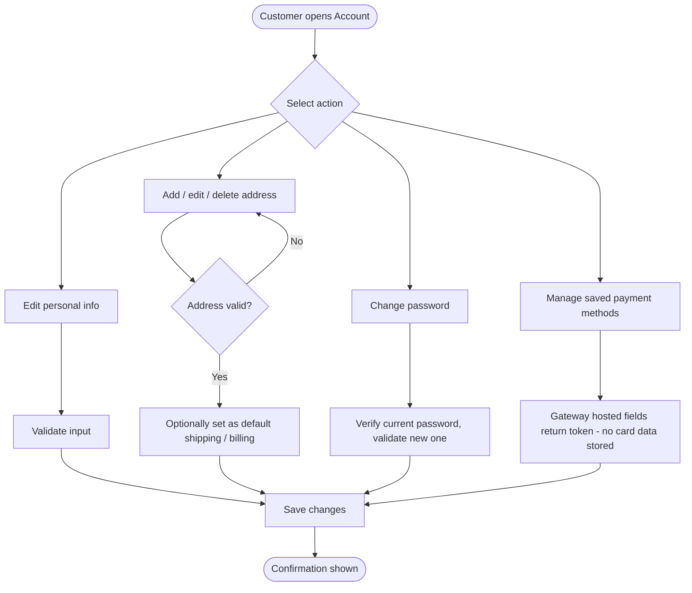
```mermaid
flowchart TD
    A([Customer opens Account]) --> B{Select action}
    B --> P[Edit personal info]
    B --> AD[Add / edit / delete address]
    B --> PW[Change password]
    B --> PM[Manage saved payment methods]
    P --> V1[Validate input] --> SAVE
    AD --> V2{Address valid?}
    V2 -- No --> AD
    V2 -- Yes --> DEF[Optionally set as default shipping / billing] --> SAVE
    PW --> V3[Verify current password, validate new one] --> SAVE
    PM --> TOK["Gateway hosted fields return token - no card data stored"] --> SAVE
    SAVE[Save changes] --> OK([Confirmation shown])
```

### UC-05 Browse Catalog by Category
Actors: Guest, Customer

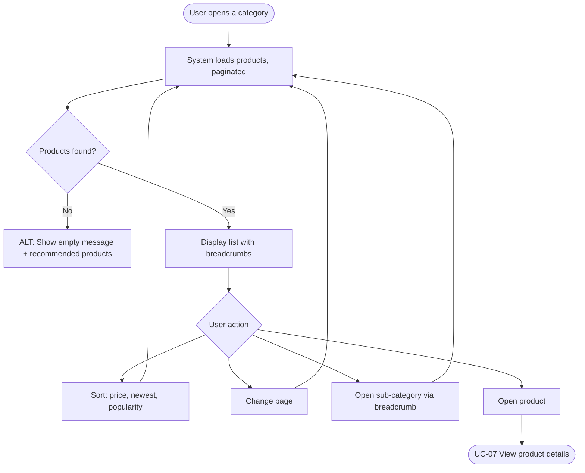
```mermaid
flowchart TD
    A([User opens a category]) --> B[System loads products, paginated]
    B --> C{Products found?}
    C -- No --> D["ALT: Show empty message + recommended products"]
    C -- Yes --> E[Display list with breadcrumbs]
    E --> F{User action}
    F --> G[Sort: price, newest, popularity] --> B
    F --> H[Change page] --> B
    F --> I[Open sub-category via breadcrumb] --> B
    F --> J[Open product] --> K([UC-07 View product details])
```

### UC-06 Search & Filter Products
Actors: Guest, Customer

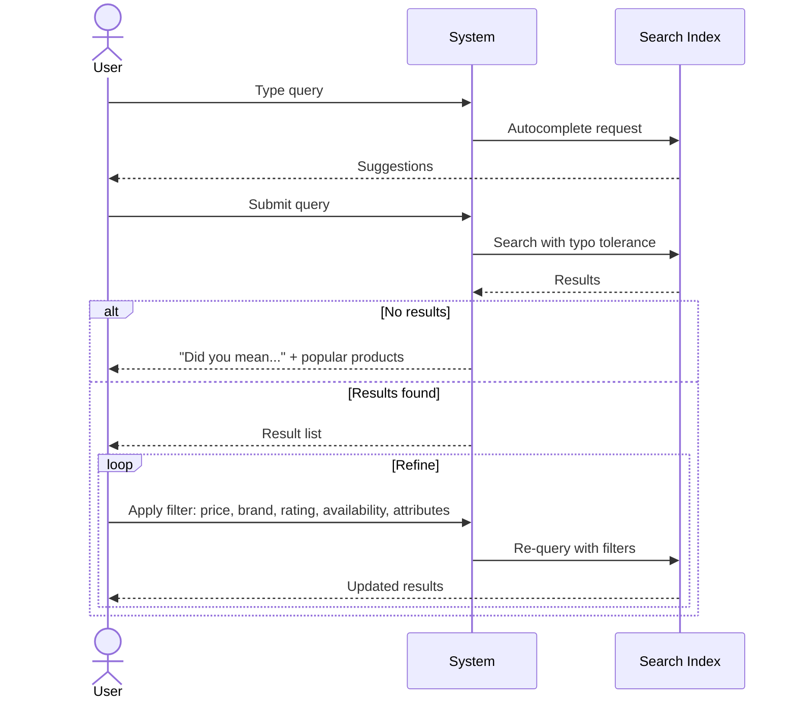
```mermaid
sequenceDiagram
    actor U as User
    participant S as System
    participant X as Search Index

    U->>S: Type query
    S->>X: Autocomplete request
    X-->>U: Suggestions
    U->>S: Submit query
    S->>X: Search with typo tolerance
    X-->>S: Results
    alt No results
        S-->>U: "Did you mean..." + popular products
    else Results found
        S-->>U: Result list
        loop Refine
            U->>S: Apply filter: price, brand, rating, availability, attributes
            S->>X: Re-query with filters
            X-->>U: Updated results
        end
    end
```

### UC-07 View Product Details
Actors: Guest, Customer

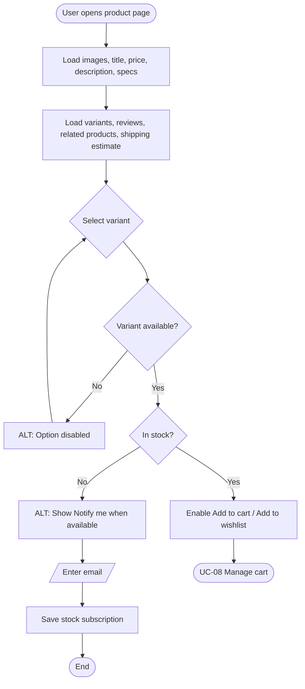
```mermaid
flowchart TD
    A([User opens product page]) --> B[Load images, title, price, description, specs]
    B --> C[Load variants, reviews, related products, shipping estimate]
    C --> D{Select variant}
    D --> E{Variant available?}
    E -- No --> F["ALT: Option disabled"] --> D
    E -- Yes --> G{In stock?}
    G -- No --> H["ALT: Show Notify me when available"]
    H --> H2[/Enter email/] --> H3[Save stock subscription] --> Z([End])
    G -- Yes --> I[Enable Add to cart / Add to wishlist]
    I --> J([UC-08 Manage cart])
```

### UC-08 Manage Shopping Cart
Actors: Guest, Customer · Post: cart persisted (cookie for guests, DB for customers)

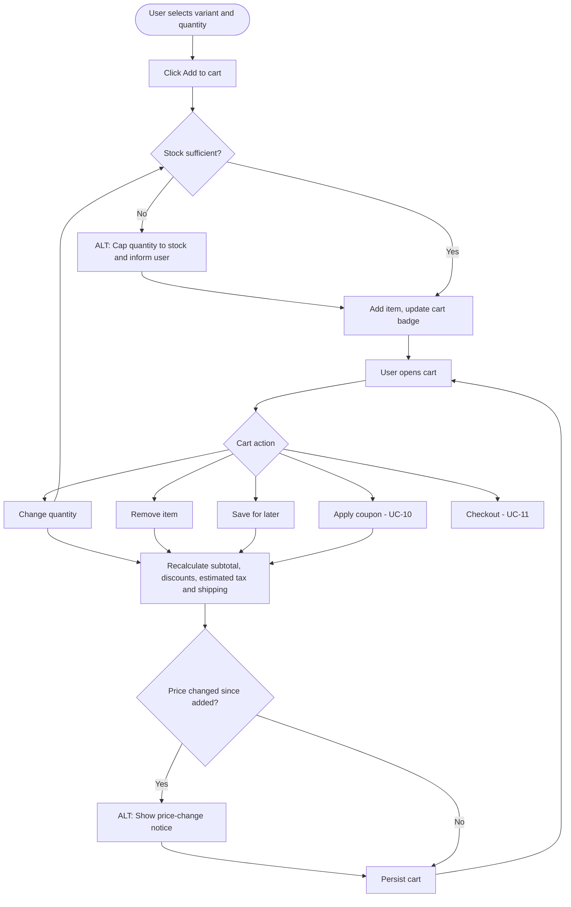
```mermaid
flowchart TD
    A([User selects variant and quantity]) --> B[Click Add to cart]
    B --> C{Stock sufficient?}
    C -- No --> D["ALT: Cap quantity to stock and inform user"] --> E
    C -- Yes --> E[Add item, update cart badge]
    E --> F[User opens cart]
    F --> G{Cart action}
    G --> H[Change quantity] --> C
    G --> I[Remove item]
    G --> J[Save for later]
    G --> K[Apply coupon - UC-10]
    G --> CO[Checkout - UC-11]
    H --> R
    I --> R
    J --> R
    K --> R
    R[Recalculate subtotal, discounts, estimated tax and shipping] --> P{Price changed since added?}
    P -- Yes --> N["ALT: Show price-change notice"] --> S
    P -- No --> S[Persist cart]
    S --> F
```

### UC-09 Manage Wishlist
Actor: Customer

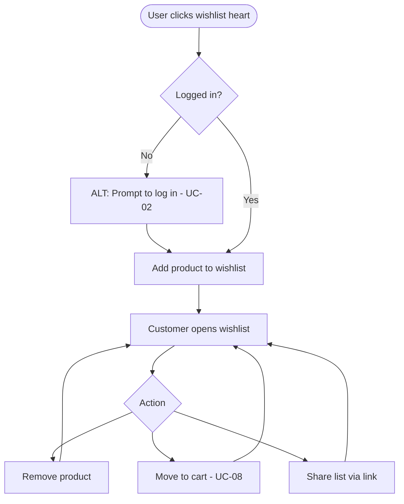
```mermaid
flowchart TD
    A([User clicks wishlist heart]) --> B{Logged in?}
    B -- No --> C["ALT: Prompt to log in - UC-02"] --> D
    B -- Yes --> D[Add product to wishlist]
    D --> E[Customer opens wishlist]
    E --> F{Action}
    F --> G[Remove product]
    F --> H[Move to cart - UC-08]
    F --> I[Share list via link]
    G --> E
    H --> E
    I --> E
```

### UC-10 Apply Coupon / Discount Code
Actors: Guest, Customer

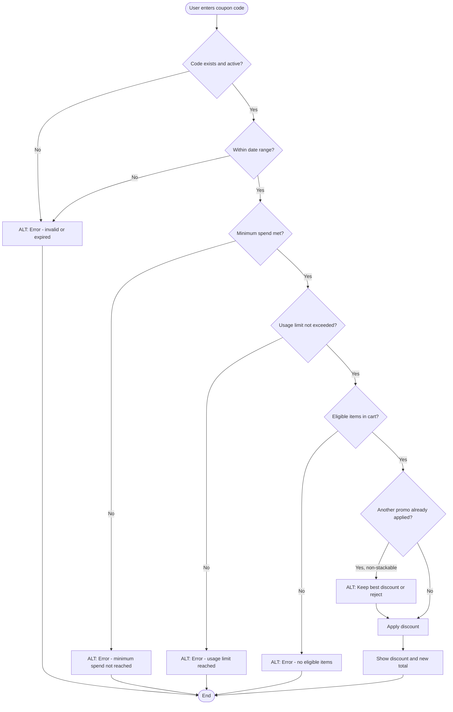
```mermaid
flowchart TD
    A([User enters coupon code]) --> B{Code exists and active?}
    B -- No --> X1["ALT: Error - invalid or expired"]
    B -- Yes --> C{Within date range?}
    C -- No --> X1
    C -- Yes --> D{"Minimum spend met?"}
    D -- No --> X2["ALT: Error - minimum spend not reached"]
    D -- Yes --> E{Usage limit not exceeded?}
    E -- No --> X3["ALT: Error - usage limit reached"]
    E -- Yes --> F{Eligible items in cart?}
    F -- No --> X4["ALT: Error - no eligible items"]
    F -- Yes --> G{Another promo already applied?}
    G -- "Yes, non-stackable" --> H["ALT: Keep best discount or reject"] --> I
    G -- No --> I[Apply discount]
    I --> J[Show discount and new total]
    J --> K([End])
    X1 --> K
    X2 --> K
    X3 --> K
    X4 --> K
```

### UC-11 Checkout & Place Order
Actors: Guest, Customer · Pre: cart not empty, items in stock · Post: order created (Pending Payment), stock reserved

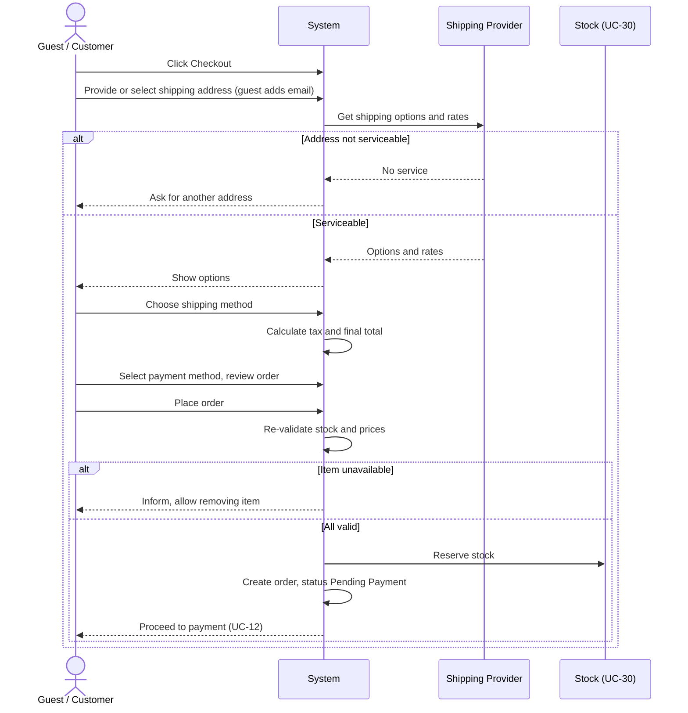
```mermaid
sequenceDiagram
    actor U as Guest / Customer
    participant S as System
    participant SP as Shipping Provider
    participant ST as Stock (UC-30)

    U->>S: Click Checkout
    U->>S: Provide or select shipping address (guest adds email)
    S->>SP: Get shipping options and rates
    alt Address not serviceable
        SP-->>S: No service
        S-->>U: Ask for another address
    else Serviceable
        SP-->>S: Options and rates
        S-->>U: Show options
        U->>S: Choose shipping method
        S->>S: Calculate tax and final total
        U->>S: Select payment method, review order
        U->>S: Place order
        S->>S: Re-validate stock and prices
        alt Item unavailable
            S-->>U: Inform, allow removing item
        else All valid
            S->>ST: Reserve stock
            S->>S: Create order, status Pending Payment
            S-->>U: Proceed to payment (UC-12)
        end
    end
```

### UC-12 Pay for Order
Actors: Customer, Payment Gateway

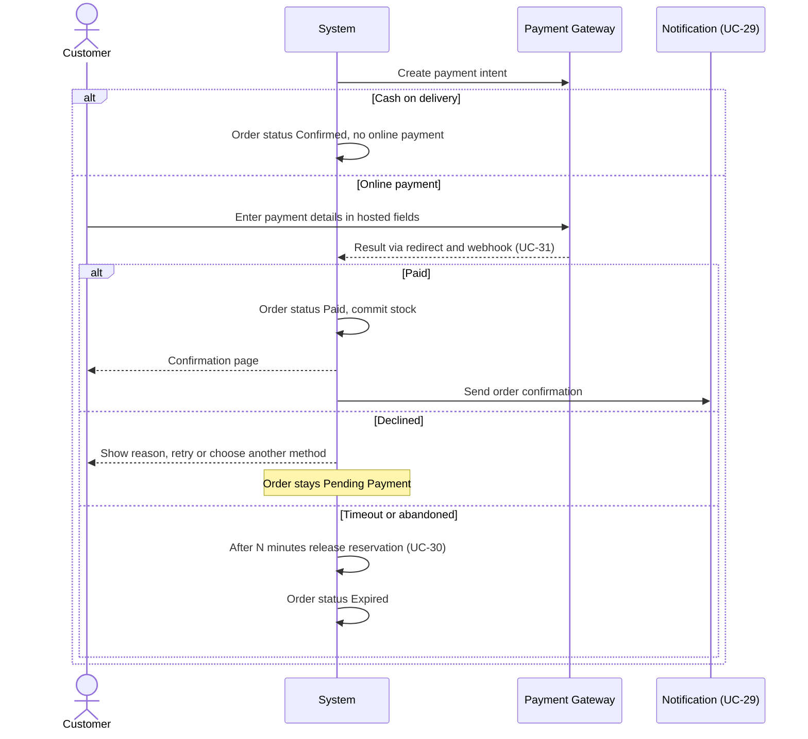
```mermaid
sequenceDiagram
    actor C as Customer
    participant S as System
    participant PG as Payment Gateway
    participant N as Notification (UC-29)

    S->>PG: Create payment intent
    alt Cash on delivery
        S->>S: Order status Confirmed, no online payment
    else Online payment
        C->>PG: Enter payment details in hosted fields
        PG-->>S: Result via redirect and webhook (UC-31)
        alt Paid
            S->>S: Order status Paid, commit stock
            S-->>C: Confirmation page
            S->>N: Send order confirmation
        else Declined
            S-->>C: Show reason, retry or choose another method
            Note over S: Order stays Pending Payment
        else Timeout or abandoned
            S->>S: After N minutes release reservation (UC-30)
            S->>S: Order status Expired
        end
    end
```

### UC-13 Track Order
Actors: Customer, Guest, Shipping Provider

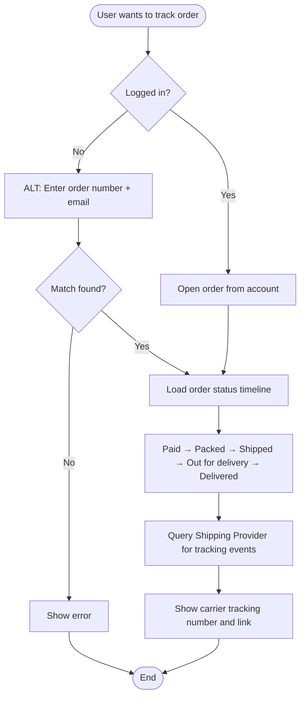
```mermaid
flowchart TD
    A([User wants to track order]) --> B{Logged in?}
    B -- Yes --> C[Open order from account]
    B -- No --> D["ALT: Enter order number + email"] --> V{Match found?}
    V -- No --> E[Show error] --> Z([End])
    V -- Yes --> F
    C --> F[Load order status timeline]
    F --> G["Paid → Packed → Shipped → Out for delivery → Delivered"]
    G --> H[Query Shipping Provider for tracking events]
    H --> I[Show carrier tracking number and link]
    I --> Z
```

### UC-14 View Order History
Actor: Customer

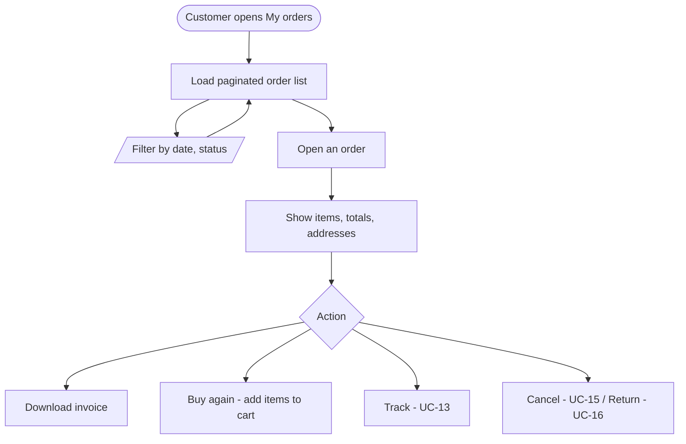
```mermaid
flowchart TD
    A([Customer opens My orders]) --> B[Load paginated order list]
    B --> C[/Filter by date, status/] --> B
    B --> D[Open an order]
    D --> E[Show items, totals, addresses]
    E --> F{Action}
    F --> G[Download invoice]
    F --> H[Buy again - add items to cart]
    F --> I[Track - UC-13]
    F --> J[Cancel - UC-15 / Return - UC-16]
```

### UC-15 Cancel Order
Actor: Customer · Pre: order not yet shipped

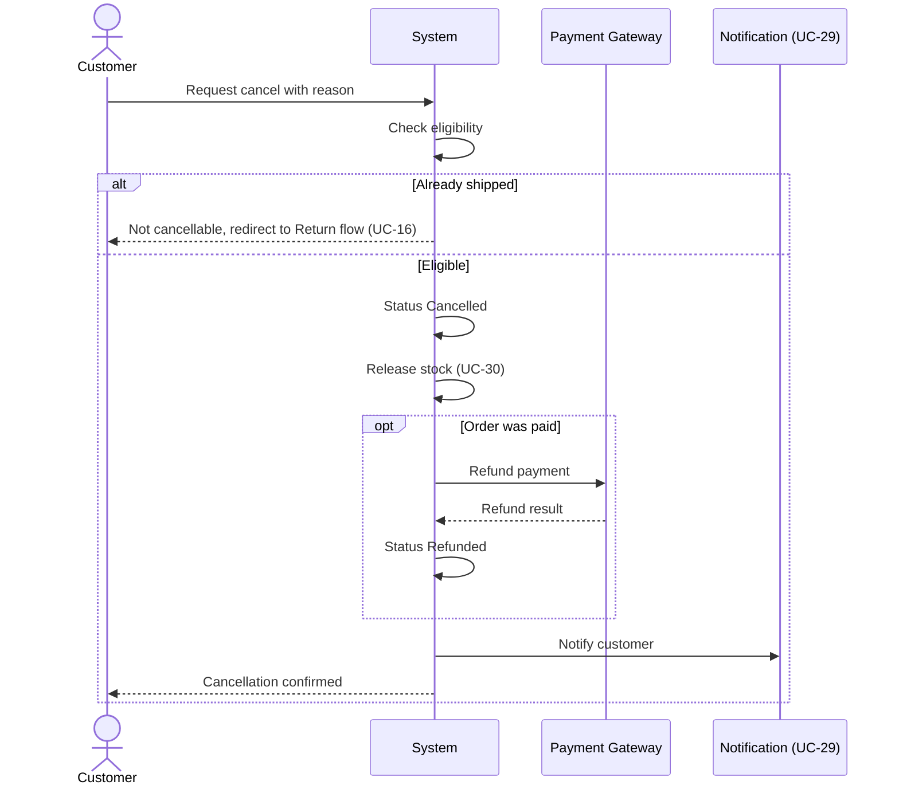
```mermaid
sequenceDiagram
    actor C as Customer
    participant S as System
    participant PG as Payment Gateway
    participant N as Notification (UC-29)

    C->>S: Request cancel with reason
    S->>S: Check eligibility
    alt Already shipped
        S-->>C: Not cancellable, redirect to Return flow (UC-16)
    else Eligible
        S->>S: Status Cancelled
        S->>S: Release stock (UC-30)
        opt Order was paid
            S->>PG: Refund payment
            PG-->>S: Refund result
            S->>S: Status Refunded
        end
        S->>N: Notify customer
        S-->>C: Cancellation confirmed
    end
```

### UC-16 Request Return / Refund
Actors: Customer, Support Agent · Pre: delivered within return window, item eligible

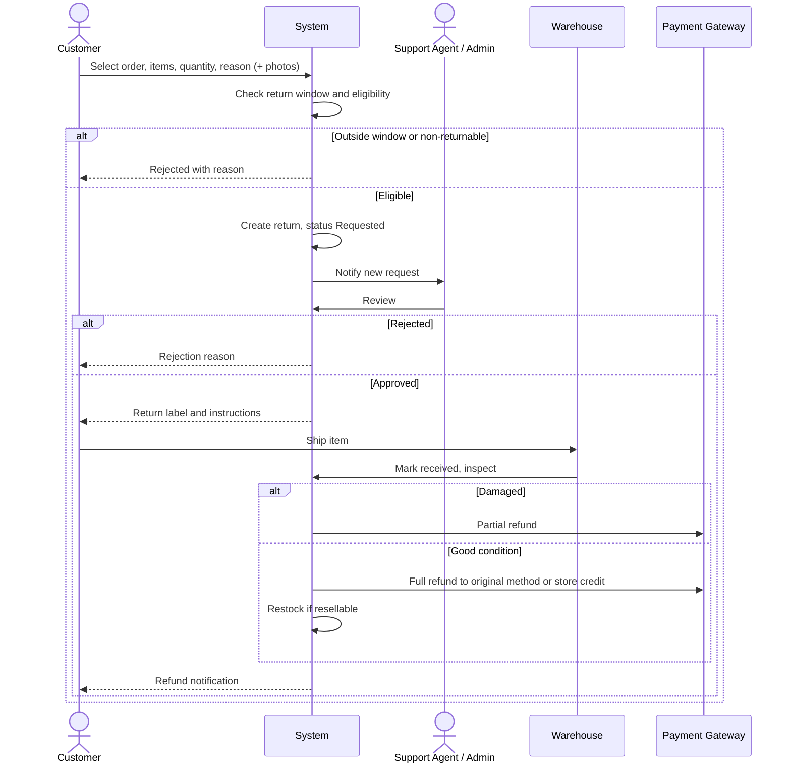
```mermaid
sequenceDiagram
    actor C as Customer
    participant S as System
    actor A as Support Agent / Admin
    participant W as Warehouse
    participant PG as Payment Gateway

    C->>S: Select order, items, quantity, reason (+ photos)
    S->>S: Check return window and eligibility
    alt Outside window or non-returnable
        S-->>C: Rejected with reason
    else Eligible
        S->>S: Create return, status Requested
        S->>A: Notify new request
        A->>S: Review
        alt Rejected
            S-->>C: Rejection reason
        else Approved
            S-->>C: Return label and instructions
            C->>W: Ship item
            W->>S: Mark received, inspect
            alt Damaged
                S->>PG: Partial refund
            else Good condition
                S->>PG: Full refund to original method or store credit
                S->>S: Restock if resellable
            end
            S-->>C: Refund notification
        end
    end
```

### UC-17 Write Product Review & Rating
Actor: Customer · Pre: verified purchase

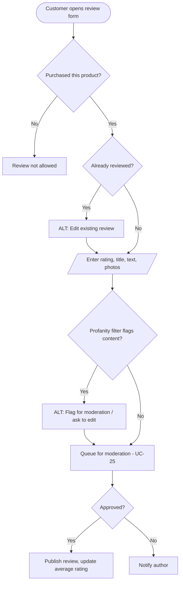
```mermaid
flowchart TD
    A([Customer opens review form]) --> B{Purchased this product?}
    B -- No --> X["Review not allowed"]
    B -- Yes --> C{Already reviewed?}
    C -- Yes --> D["ALT: Edit existing review"] --> E
    C -- No --> E[/Enter rating, title, text, photos/]
    E --> F{Profanity filter flags content?}
    F -- Yes --> G["ALT: Flag for moderation / ask to edit"] --> H
    F -- No --> H[Queue for moderation - UC-25]
    H --> I{Approved?}
    I -- Yes --> J[Publish review, update average rating]
    I -- No --> K[Notify author]
```

### UC-18 Contact Customer Support
Actors: Guest, Customer, Support Agent

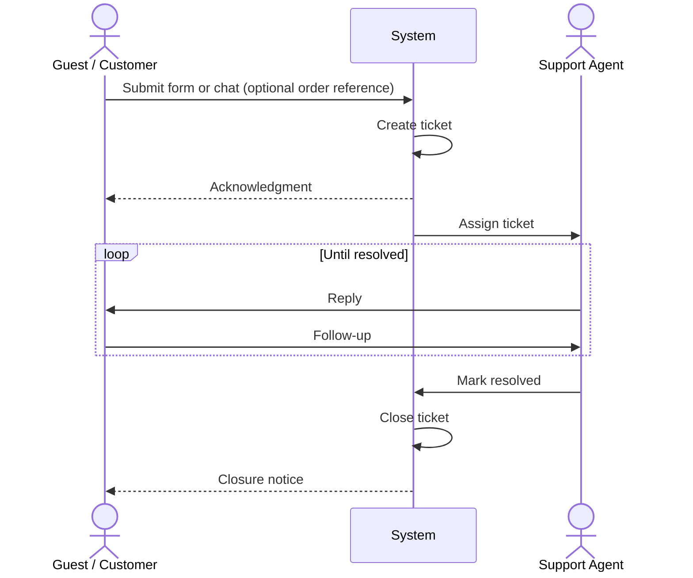
```mermaid
sequenceDiagram
    actor U as Guest / Customer
    participant S as System
    actor A as Support Agent

    U->>S: Submit form or chat (optional order reference)
    S->>S: Create ticket
    S-->>U: Acknowledgment
    S->>A: Assign ticket
    loop Until resolved
        A->>U: Reply
        U->>A: Follow-up
    end
    A->>S: Mark resolved
    S->>S: Close ticket
    S-->>U: Closure notice
```

---

## 2. Back-office use cases

### UC-19 Manage Products & Categories
Actor: Admin

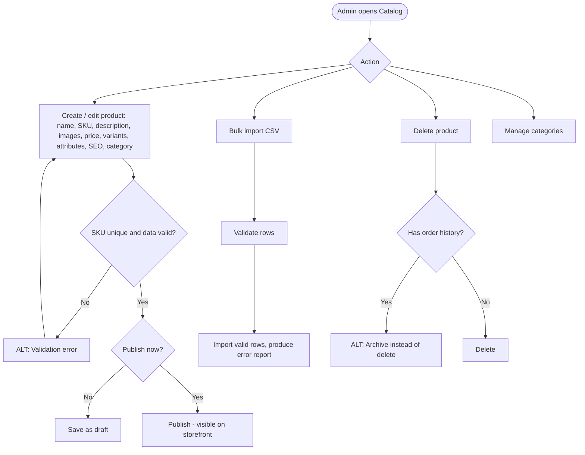
```mermaid
flowchart TD
    A([Admin opens Catalog]) --> B{Action}
    B --> C[Create / edit product: name, SKU, description, images, price, variants, attributes, SEO, category]
    B --> D[Bulk import CSV]
    B --> E[Delete product]
    B --> F[Manage categories]
    C --> G{SKU unique and data valid?}
    G -- No --> H["ALT: Validation error"] --> C
    G -- Yes --> I{Publish now?}
    I -- No --> J[Save as draft]
    I -- Yes --> K[Publish - visible on storefront]
    D --> L[Validate rows] --> M[Import valid rows, produce error report]
    E --> N{Has order history?}
    N -- Yes --> O["ALT: Archive instead of delete"]
    N -- No --> P[Delete]
```

### UC-20 Manage Inventory
Actor: Admin · Rule: no negative stock unless backorders enabled

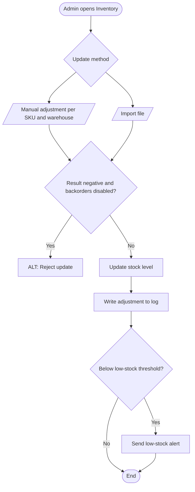
```mermaid
flowchart TD
    A([Admin opens Inventory]) --> B{Update method}
    B --> C[/Manual adjustment per SKU and warehouse/]
    B --> D[/Import file/]
    C --> E
    D --> E{Result negative and backorders disabled?}
    E -- Yes --> F["ALT: Reject update"]
    E -- No --> G[Update stock level]
    G --> H[Write adjustment to log]
    H --> I{Below low-stock threshold?}
    I -- Yes --> J[Send low-stock alert]
    I -- No --> K([End])
    J --> K
```

### UC-21 Manage Orders
Actor: Admin

```mermaid
sequenceDiagram
    actor A as Admin
    participant S as System
    participant SP as Shipping Provider
    participant N as Notification (UC-29)

    A->>S: View and filter orders
    A->>S: Open order
    opt Before shipping
        A->>S: Edit address
        A->>S: Split shipment
    end
    alt Cancel
        A->>S: Cancel order
        S->>S: Release stock, refund if paid
    else Fulfil
        A->>S: Set status Packed
        A->>SP: Generate label / tracking number
        SP-->>S: Tracking number
        A->>S: Set status Shipped
    end
    S->>N: Notify customer
```

### UC-22 Process Returns & Refunds
Actors: Admin, Support Agent

```mermaid
flowchart TD
    A([Agent opens return requests]) --> B[Review request, photos, reason]
    B --> C{Decision}
    C -- Reject --> D[Send rejection reason to customer]
    C -- Approve --> E[Send return label and instructions]
    E --> F[Item received and inspected]
    F --> G{Condition}
    G -- Damaged --> H[Partial refund via gateway]
    G -- OK --> I[Full refund via gateway]
    H --> J{Gateway refund succeeded?}
    I --> J
    J -- No --> K["ALT: Flag for manual handling"]
    J -- Yes --> L[Update order and stock]
    K --> M
    L --> M[Record in audit log]
    D --> M
    M --> N([End])
```

### UC-23 Manage Customers
Actor: Admin

```mermaid
flowchart TD
    A([Admin opens Customers]) --> B[Search customers]
    B --> C[View profile and orders]
    C --> D{Action}
    D --> E[Deactivate account]
    D --> F[Reactivate account]
    D --> G[GDPR request: anonymize personal data]
    G --> H{Open orders or legal retention?}
    H -- Yes --> I["ALT: Anonymize only allowed fields, keep order records"]
    H -- No --> J[Anonymize all personal data]
    E --> K[Write audit log]
    F --> K
    I --> K
    J --> K
```

### UC-24 Manage Promotions & Coupons
Actor: Admin

```mermaid
flowchart TD
    A([Admin creates promotion]) --> B[/Choose type: percentage, fixed, free shipping, BOGO/]
    B --> C[/Set conditions: min spend, eligible items/]
    C --> D[/Set validity dates and usage limits/]
    D --> E{Applied by code?}
    E -- Yes --> F[Generate or enter coupon code]
    E -- No --> G[Automatic rule]
    F --> H{Valid and no conflicts?}
    G --> H
    H -- No --> I["ALT: Show validation errors"] --> B
    H -- Yes --> J[Activate promotion]
    J --> K([Applied at cart / checkout - UC-10])
```

### UC-25 Moderate Reviews
Actor: Admin

```mermaid
flowchart TD
    A([Admin opens review queue]) --> B[View pending / flagged reviews]
    B --> C{Decision}
    C -- Approve --> D[Publish, update average rating]
    C -- Reject --> E[Reject with reason] --> F[Notify author]
    C -- Delete --> G[Delete review, update average rating]
```

### UC-26 View Sales Reports & Analytics
Actor: Admin

```mermaid
sequenceDiagram
    actor A as Admin
    participant S as System
    participant D as Reporting Data

    A->>S: Select report and date range
    S->>D: Query revenue, orders, AOV, conversion, top products, stock value, refunds
    D-->>S: Aggregated data
    S-->>A: Dashboard with charts and tables
    opt Export
        A->>S: Export CSV / PDF
        S-->>A: File download
    end
```

### UC-27 Configure Shipping, Tax & Payment Settings
Actor: Admin

```mermaid
flowchart TD
    A([Admin opens Settings]) --> B{Section}
    B --> C[Shipping zones and rates]
    B --> D[Tax rules per region]
    B --> E[Enabled payment methods and gateway keys]
    B --> F[Store info]
    B --> G[Email templates]
    C --> V
    D --> V
    E --> V
    F --> V
    G --> V{Valid?}
    V -- No --> W["ALT: Show errors"] --> B
    V -- Yes --> S[Save settings]
    S --> L[Write audit log]
    L --> Z([Applied to storefront])
```

### UC-28 Manage Staff Roles & Permissions
Actor: Admin

```mermaid
flowchart TD
    A([Admin opens Staff]) --> B{Action}
    B --> C[Create staff account]
    B --> D[Edit / disable staff]
    B --> E[Define role permissions]
    C --> F[Assign role: Catalog Manager, Order Manager, Support]
    D --> F
    E --> F
    F --> G[Save]
    G --> H[System enforces RBAC on every request]
    G --> I[Write audit log]
    H --> J{Staff attempts sensitive action}
    J -- Permitted --> K[Execute and audit log]
    J -- Not permitted --> L[Deny 403 and log]
```

---

## 3. System / automated use cases

### UC-29 Send Transactional Notifications
Actor: Notification Service

```mermaid
sequenceDiagram
    participant E as Domain Event
    participant S as System
    participant Q as Queue
    participant N as Notification Service
    actor C as Customer

    E->>S: Event: registration, order placed, paid, shipped, delivered, refund, password reset
    S->>S: Render template with data
    S->>Q: Enqueue message
    Q->>N: Deliver email / SMS
    alt Sent
        N-->>C: Message
        N-->>S: Delivery status
        S->>S: Log delivery
    else Failed
        N-->>S: Error
        S->>Q: Retry with exponential backoff
        Note over S: After max retries, log failure and alert
    end
```

### UC-30 Reserve & Release Stock
Actor: System

```mermaid
stateDiagram-v2
    [*] --> Available
    Available --> Reserved: Order created (atomic check and decrement)
    Reserved --> Committed: Payment success
    Reserved --> Available: Payment expired or order cancelled
    Committed --> Available: Return restocked
    Committed --> [*]: Shipped
    note right of Reserved
        Prevents overselling
        under concurrent checkouts
    end note
```

### UC-31 Handle Payment Webhooks
Actor: Payment Gateway

```mermaid
sequenceDiagram
    participant PG as Payment Gateway
    participant S as System
    participant DB as Database

    PG->>S: POST webhook event
    S->>S: Verify signature
    alt Invalid signature
        S-->>PG: 400, log and alert
    else Valid
        S->>DB: Look up event id
        alt Unknown order or duplicate event
            S->>S: Ignore and log
            S-->>PG: 200
        else New event
            S->>DB: Update payment and order status idempotently
            S->>S: Trigger notifications (UC-29)
            S-->>PG: 200
        end
    end
```

### UC-32 Abandoned Cart Reminder
Actor: System

```mermaid
flowchart TD
    A([Scheduled job runs]) --> B[Find carts with items idle 24h]
    B --> C{User email known?}
    C -- No --> Z([Skip])
    C -- Yes --> D{Purchased since or unsubscribed?}
    D -- Yes --> Z
    D -- No --> E[Build reminder, optional incentive]
    E --> F[Send via Notification Service - UC-29]
    F --> G[Record reminder sent]
    G --> H{User purchases or unsubscribes?}
    H -- No --> I[Next reminder per schedule, up to max] --> D
    H -- Yes --> Z2([Stop reminders])
```
